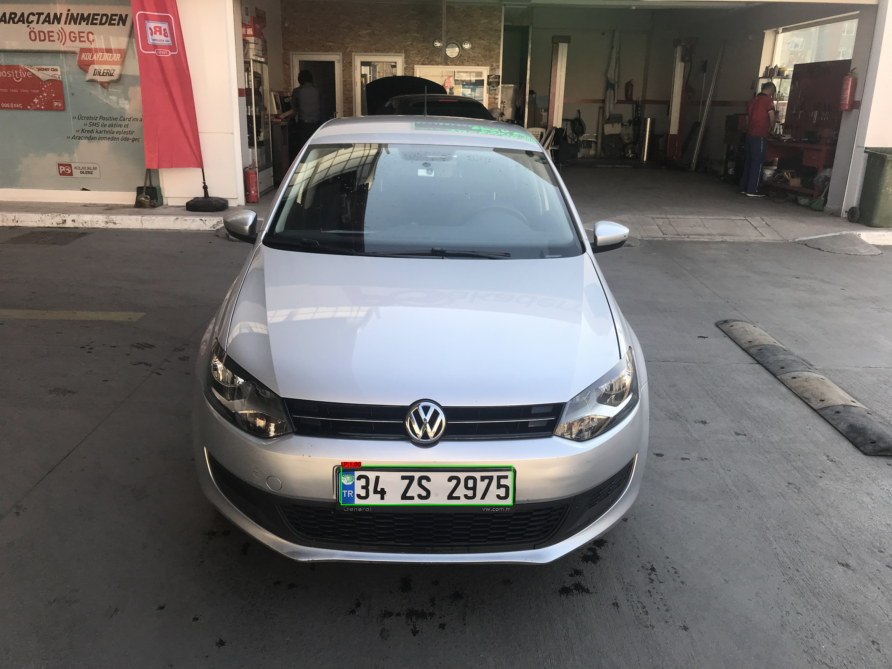

# Automatic License Plate Detection & Recognition using deep learning

In this repos we study number plate detection and recognition using different cnn optimizer models and computer vision approches.

You will find more information about how to train project on your customized dataset in this [Link](https://towardsdatascience.com/automatic-license-plate-detection-recognition-using-deep-learning-624def07eaaf).

There is also other Deep learning object detector that you can use such as 7 optimizer algorithms.
#### How to use : 
We used python v3.7.6
install requirement
````
pip install -r requirement.txt
````

Detect edges from an image
````
python detector.py --image test.jpg
````

To detect edges from a video
````
python detector.py --video test.mp4
````

#### Examples :

Detection from image :


### Licence plate recognition :

We are stadying license plates for the recognition, check the sub folders in plates recognition folder!

Create dataset
````
python create_dataset.py
````

Train model
````
python train.py
````

Predict to image
````
python predict.py
````
